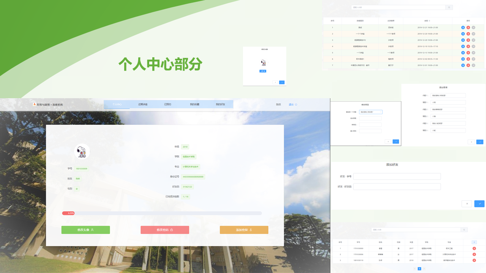
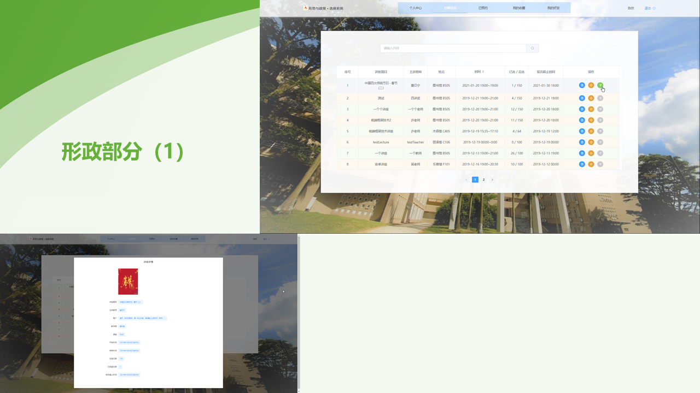
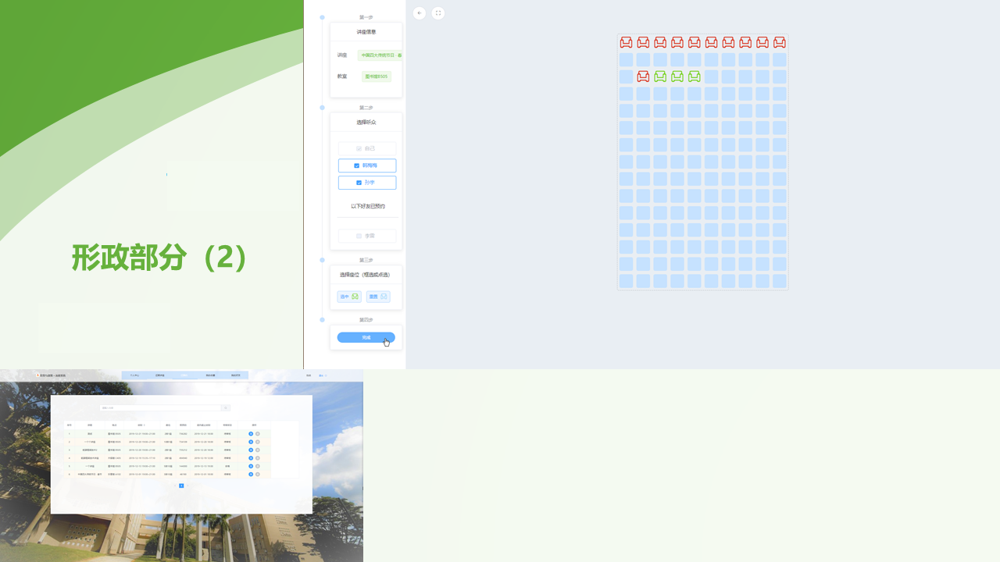
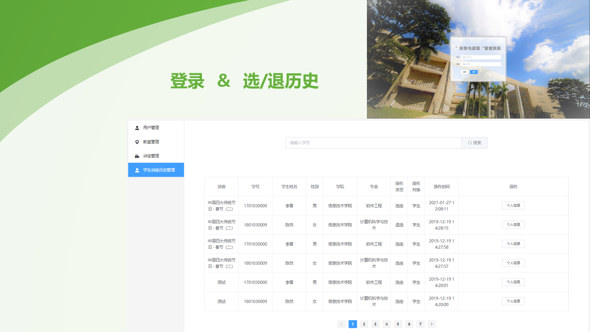
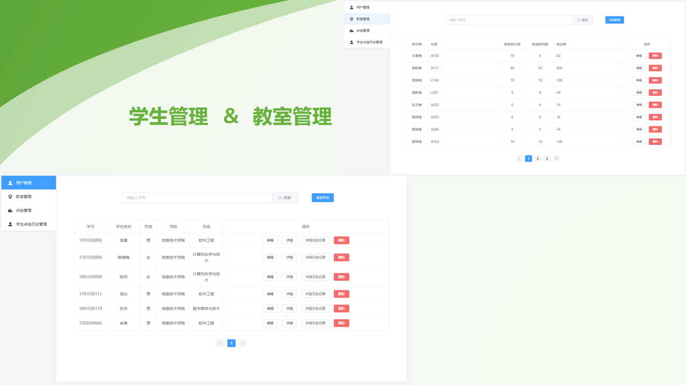
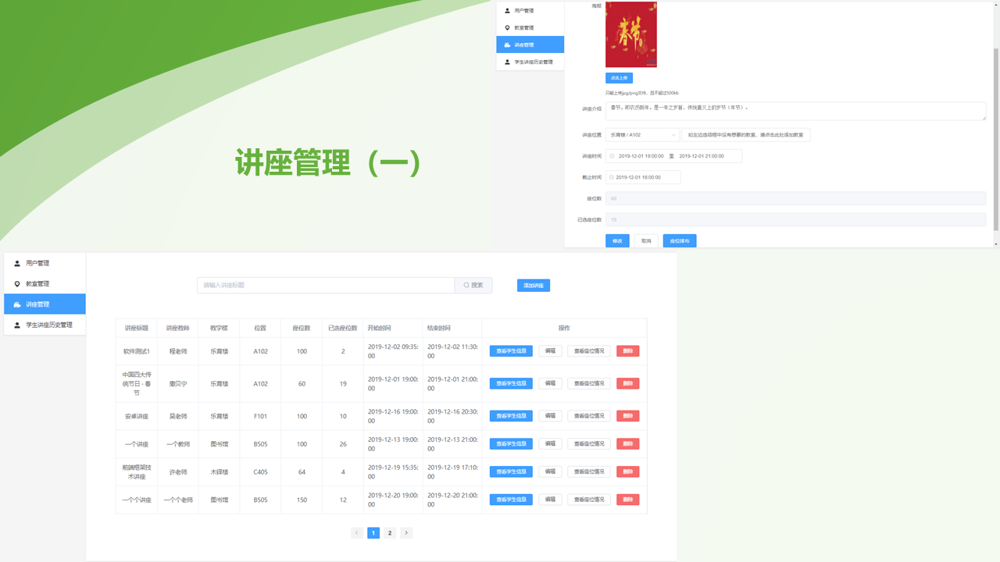
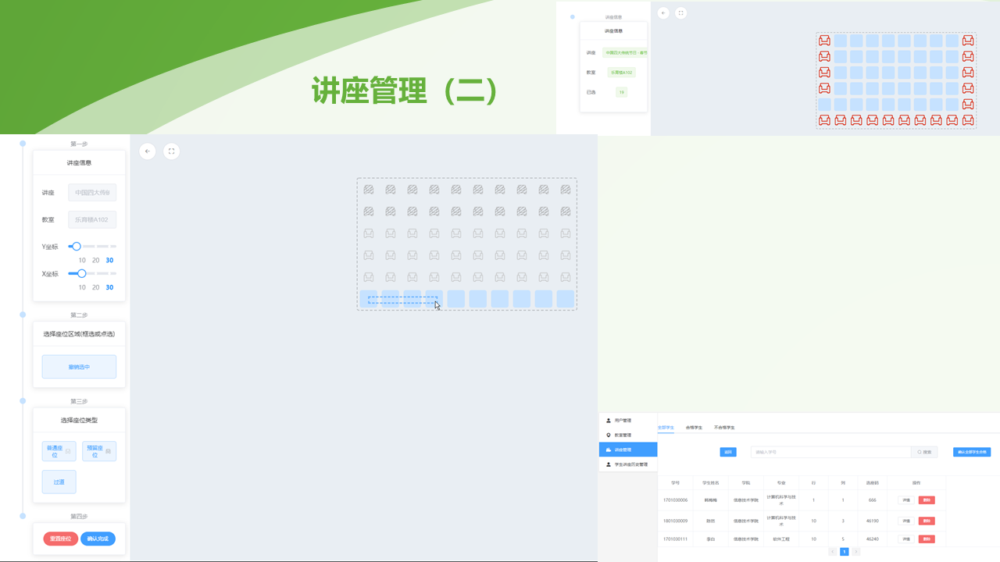

# seat_selection

形势与政策 ▪ 选座系统

## 技术栈

- 后端：Node.js
- 后端框架：Express
- 数据库：MySql
- 前端：Vue.js
- 前端请求：Axios
- 前端UI：Element-UI
- 单页应用扩展：Vuex
- 滚动场景插件：BetterScroll

## 效果预览

### 用户端

#### 登录


#### 个人中心



#### 形政





### 管理端

#### 登录 & 选退历史



#### 学生管理 & 教室管理



#### 讲座管理





## 说明

### 目录结构

```bash
├── seat_selection_user 用户端页面项目文件
├── seat_selection_admin 管理端页面项目文件
├── seat_selection_api 前后台接口文件
```

### 数据库

- 连接：./seat_selection_api/db/db.js
- 数据：./seat_selection_api/db/db_structure.sql
- 关系：

### 安装启动

```bash
# 后端
cd seat_selection_api
npm install
node app

# 用户端
cd seat_selection_user
npm install
npm start

# 管理端
cd seat_selection_admin
npm install
npm start
```

## 代码

- [Feuoy](https://github.com/Feuoy)
- [BlackXuuuuuu](https://github.com/BlackXuuuuuu)

## 参考

[https://github.com/J1ong/FilmSys](https://github.com/J1ong/FilmSys)
