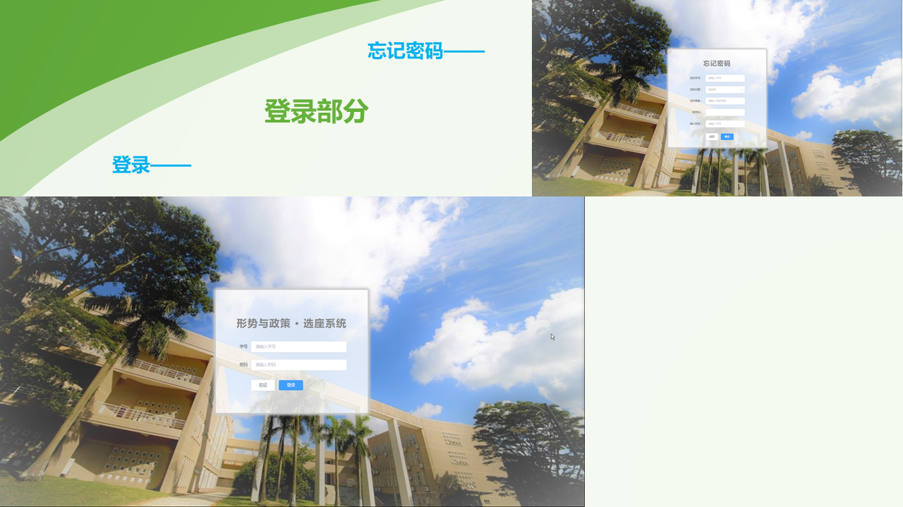
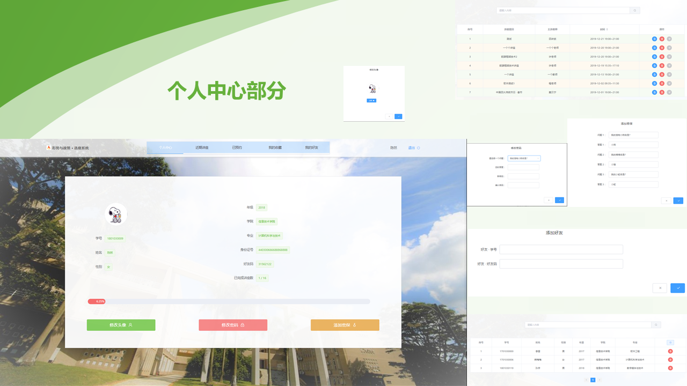
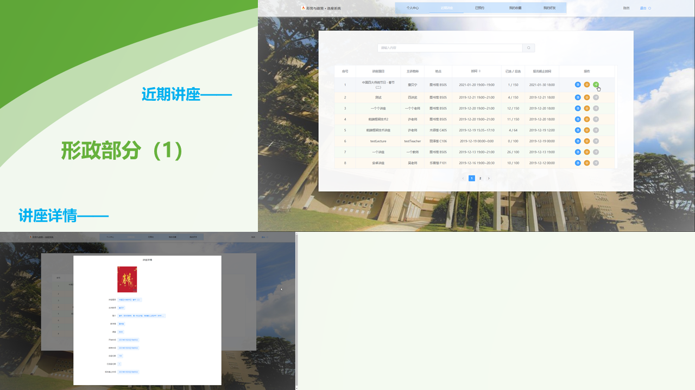
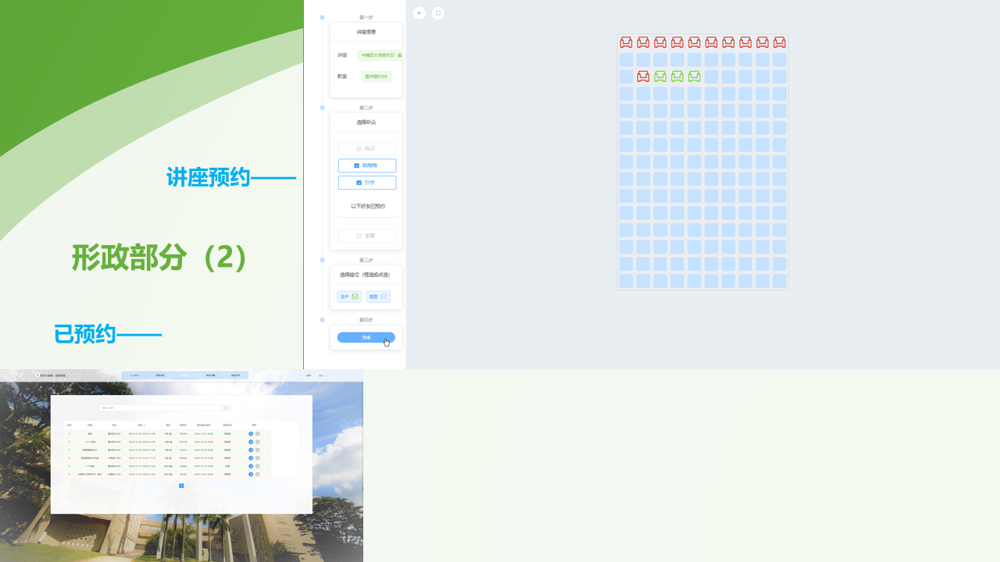
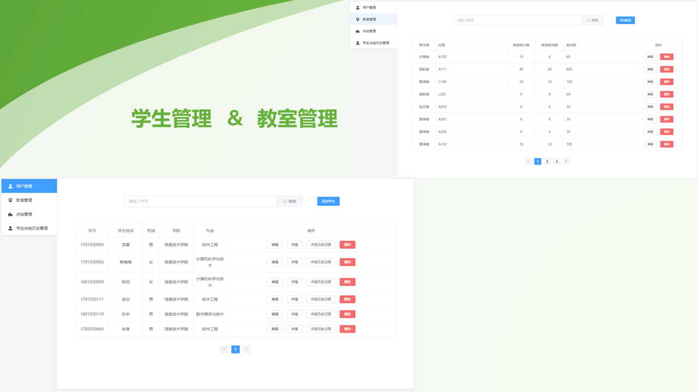
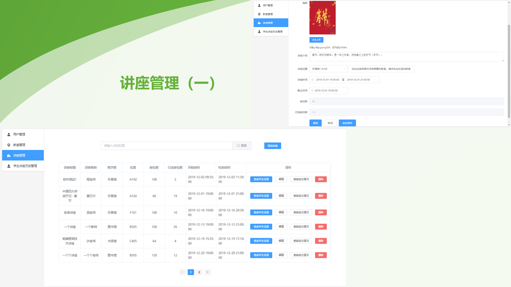
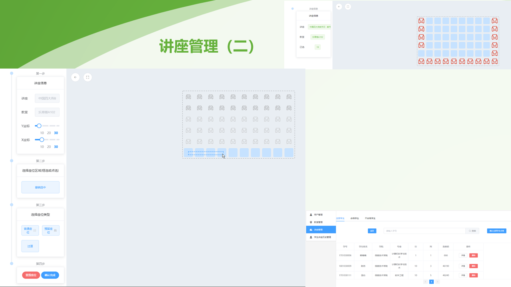
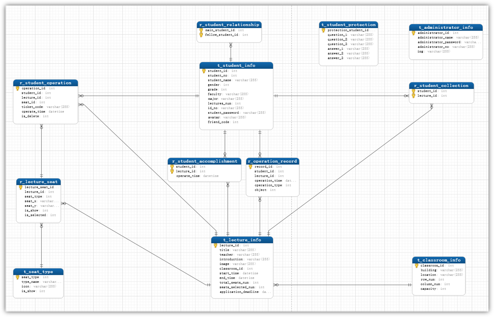

# seat_selection

形势与政策 ▪ 选座系统

## 技术栈

- 后端：Node.js
- 后端框架：Express
- 数据库：MySql
- 前端：Vue.js
- 前端请求：Axios
- 前端UI：Element-UI

## 效果预览

### 用户端

#### 1.登录部分


#### 2.个人中心部分


#### 3.行政部分（1）


#### 4.行政部分（2）



### 管理端

#### 1.登录 & 选退历史


#### 2.学生管理 & 教室管理


#### 3.讲座管理（一）


#### 4,讲座管理（二）



## 项目说明

### 1.目录结构

```bash
├── seat_selection_user 用户端页面项目文件
├── seat_selection_admin 管理端页面项目文件
├── seat_selection_api 前后台接口文件
```

### 2. 数据库

- 连接：./seat_selection_api/db/db.js
- 数据：./seat_selection_api/db/db_structure.sql
- 关系：

### 3. 安装启动

```bash
# 后端
cd seat_selection_api
npm install
node app

# 用户端
cd seat_selection_user
npm install
npm start

# 管理端
cd seat_selection_admin
npm install
npm start
```

## 项目成员

- 用户端：[Feuoy](https://github.com/Feuoy)
- 管理端：[BlackXuuuuuu](https://github.com/BlackXuuuuuu)
- 本项目：[seat_selection](https://github.com/Feuoy/seat_selection)
- 原项目：[seat_selection](https://github.com/BlackXuuuuuu/seat_selection)

## 参考

[https://github.com/J1ong/FilmSys](https://github.com/J1ong/FilmSys)
